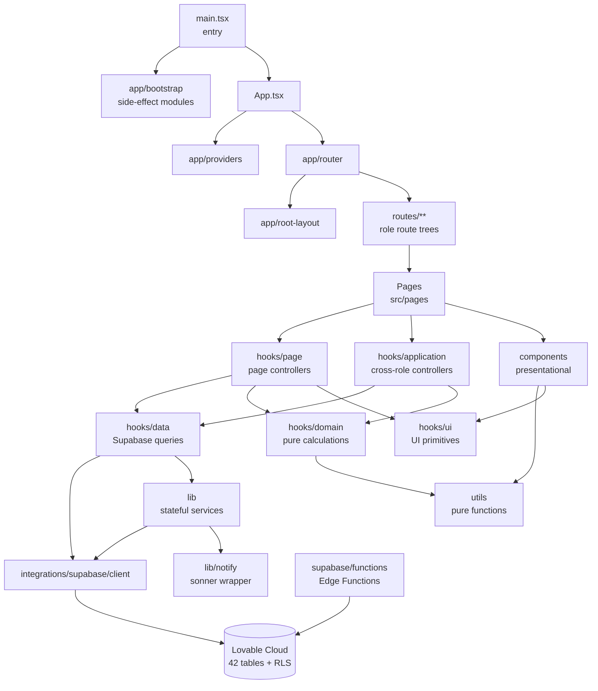

# خريطة الطبقات — Architecture Map

اتجاه الاعتماد يسير من الأعلى للأسفل فقط. أي سهم معكوس = انتهاك.

## قواعد الاتجاه

| من | إلى | مسموح؟ |
|---|---|---|
| `main.tsx` | `app/bootstrap/**` فقط | ✅ (P4) |
| `app/bootstrap/**` | `hooks/**` أو `pages/**` | ❌ (side effects only) |
| `pages/**` | `hooks/page/**` أو `hooks/application/**` | ✅ |
| `pages/**` | `hooks/data/**` | ❌ Critical (CoreModV7) |
| `pages/**` | `@/integrations/supabase/client` | ❌ Critical |
| `components/**` | `hooks/data/**` | ❌ |
| `components/**` | `@/integrations/supabase/client` | ❌ Critical |
| `hooks/data/**` | `sonner` / `@/lib/notify` | ❌ (No Toast in Data Hooks) |
| `hooks/**` | `@/pages/**` | ❌ Critical (HookDirection) |
| `utils/**` | `@/integrations/supabase/client` | ❌ Critical (lib vs utils boundary) |
| `utils/**` | `sonner` | ❌ Critical |
| `utils/**` | `@/hooks/**` | ❌ (يكسر اتجاه الاعتماد) |
| `lib/**` | `@/integrations/supabase/client` | ✅ |
| `index.ts` (barrel) | barrel آخر | ❌ Warning (Barrel Import Rule) |

## بوابة الإنفاذ

- `npm run audit` يُشغّل 5 سكربتات + يولّد `audit/report.html`.
- `npm run audit:gate` (Vitest) يفرض القواعد الحرجة.
- `.husky/pre-push` يمنع الـ push عند فشل أي بوابة.
- `.github/workflows/ci.yml` يطبّق نفس البوابات على كل PR.

راجع `audit/structure-deep-review.md` للحالة التفصيلية.
