# توثيق قاعدة البيانات

## مخطط العلاقات (ERD)

```mermaid
erDiagram
    user_roles {
        uuid id PK
        uuid user_id FK
        app_role role
        timestamptz created_at
    }

    beneficiaries {
        uuid id PK
        text name
        numeric share_percentage
        uuid user_id FK "nullable"
        text email
        text phone
        text bank_account
        text national_id
        text notes
    }

    properties {
        uuid id PK
        text property_number
        text property_type
        text location
        numeric area
        text description
    }

    units {
        uuid id PK
        uuid property_id FK
        text unit_number
        text unit_type
        text floor
        numeric area
        text status
    }

    contracts {
        uuid id PK
        text contract_number
        uuid property_id FK
        uuid unit_id FK "nullable"
        text tenant_name
        date start_date
        date end_date
        numeric rent_amount
        text payment_type
        numeric payment_amount
        integer payment_count
        text status
        text notes "nullable"
        uuid fiscal_year_id FK "nullable"
    }

    income {
        uuid id PK
        text source
        numeric amount
        date date
        uuid property_id FK "nullable"
        uuid contract_id FK "nullable"
        uuid fiscal_year_id FK "nullable"
        text notes
    }

    expenses {
        uuid id PK
        text expense_type
        numeric amount
        date date
        text description
        uuid property_id FK "nullable"
        uuid fiscal_year_id FK "nullable"
    }

    invoices {
        uuid id PK
        text invoice_type
        text invoice_number
        numeric amount
        date date
        text status
        text file_path
        text description "nullable"
        text file_name "nullable"
        uuid property_id FK "nullable"
        uuid contract_id FK "nullable"
        uuid expense_id FK "nullable"
        uuid fiscal_year_id FK "nullable"
    }

    fiscal_years {
        uuid id PK
        text label
        date start_date
        date end_date
        text status
        boolean published
    }

    accounts {
        uuid id PK
        text fiscal_year
        uuid fiscal_year_id FK "nullable"
        numeric total_income
        numeric total_expenses
        numeric vat_amount
        numeric zakat_amount
        numeric admin_share
        numeric waqif_share
        numeric waqf_revenue
        numeric waqf_corpus_previous
        numeric waqf_corpus_manual
        numeric distributions_amount
        numeric net_after_expenses
        numeric net_after_vat
    }

    distributions {
        uuid id PK
        uuid account_id FK
        uuid beneficiary_id FK
        uuid fiscal_year_id FK "nullable"
        numeric amount
        date date
        text status
    }

    tenant_payments {
        uuid id PK
        uuid contract_id FK
        integer paid_months
        text notes
    }

    conversations {
        uuid id PK
        uuid created_by
        uuid participant_id "nullable"
        text subject
        text type
        text status
    }

    messages {
        uuid id PK
        uuid conversation_id FK
        uuid sender_id
        text content
        boolean is_read
    }

    notifications {
        uuid id PK
        uuid user_id
        text title
        text message
        text type
        text link
        boolean is_read
    }

    audit_log {
        uuid id PK
        text table_name
        text operation
        uuid record_id
        jsonb old_data
        jsonb new_data
        uuid user_id
    }

    access_log {
        uuid id PK
        text event_type
        text email "nullable"
        uuid user_id "nullable"
        text target_path "nullable"
        text device_info "nullable"
        jsonb metadata
        timestamptz created_at
    }

    access_log_archive {
        uuid id PK
        text event_type
        text email "nullable"
        uuid user_id "nullable"
        text target_path "nullable"
        text device_info "nullable"
        jsonb metadata
        timestamptz created_at
        timestamptz archived_at
    }

    advance_requests {
        uuid id PK
        uuid beneficiary_id FK
        uuid fiscal_year_id FK "nullable"
        numeric amount
        text reason "nullable"
        text status
        text rejection_reason "nullable"
        uuid approved_by "nullable"
        timestamptz approved_at "nullable"
        timestamptz paid_at "nullable"
        timestamptz created_at
    }

    advance_carryforward {
        uuid id PK
        uuid beneficiary_id FK
        uuid from_fiscal_year_id FK
        uuid to_fiscal_year_id FK "nullable"
        numeric amount
        text status
        text notes "nullable"
        timestamptz created_at
    }

    webauthn_challenges {
        uuid id PK
        uuid user_id "nullable"
        text challenge
        text type
        timestamptz created_at
    }

    webauthn_credentials {
        uuid id PK
        uuid user_id FK
        text credential_id
        text public_key
        bigint counter
        text[] transports "nullable"
        text device_name "nullable"
        timestamptz created_at
    }

    app_settings {
        text key PK
        text value
    }

    waqf_bylaws {
        uuid id PK
        integer part_number
        text part_title
        integer chapter_number "nullable"
        text chapter_title "nullable"
        text content
        boolean is_visible
        integer sort_order
    }

    payment_invoices {
        uuid id PK
        uuid contract_id FK
        uuid fiscal_year_id FK "nullable"
        text invoice_number
        integer payment_number
        date due_date
        numeric amount
        text status
        date paid_date "nullable"
        numeric paid_amount "nullable"
        text notes "nullable"
    }

    contract_fiscal_allocations {
        uuid id PK
        uuid contract_id FK
        uuid fiscal_year_id FK
        date period_start
        date period_end
        numeric allocated_payments
        numeric allocated_amount
    }

    rate_limits {
        text key PK
        integer count
        timestamptz window_start
    }

    properties ||--o{ units : "تحتوي"
    properties ||--o{ contracts : "مرتبطة"
    units ||--o{ contracts : "مؤجرة"
    contracts ||--o{ income : "تولّد"
    contracts ||--o{ invoices : "لها فواتير"
    contracts ||--|| tenant_payments : "دفعات"
    contracts ||--o{ payment_invoices : "فواتير دفعات"
    contracts ||--o{ contract_fiscal_allocations : "تخصيص"
    properties ||--o{ income : "دخل"
    properties ||--o{ expenses : "مصروفات"
    expenses ||--o{ invoices : "فاتورة مصروف"
    fiscal_years ||--o{ income : "سنة مالية"
    fiscal_years ||--o{ expenses : "سنة مالية"
    fiscal_years ||--o{ invoices : "سنة مالية"
    fiscal_years ||--o{ accounts : "سنة مالية"
    fiscal_years ||--o{ distributions : "سنة مالية"
    fiscal_years ||--o{ advance_requests : "سنة مالية"
    fiscal_years ||--o{ advance_carryforward : "من سنة"
    fiscal_years ||--o{ payment_invoices : "سنة مالية"
    fiscal_years ||--o{ contract_fiscal_allocations : "سنة مالية"
    accounts ||--o{ distributions : "توزيعات"
    beneficiaries ||--o{ distributions : "يستلم"
    beneficiaries ||--o{ advance_requests : "طلبات سلف"
    beneficiaries ||--o{ advance_carryforward : "ترحيل سلف"
    conversations ||--o{ messages : "رسائل"
```

---

## الجداول والأعمدة (37 جدول/عرض)

### 1. `user_roles` — أدوار المستخدمين
| العمود | النوع | وصف |
|--------|-------|------|
| `id` | UUID | المعرف الفريد |
| `user_id` | UUID | معرف المستخدم (من نظام المصادقة) |
| `role` | app_role | الدور: `admin` / `beneficiary` / `waqif` / `accountant` |

### 2. `properties` — العقارات
| العمود | النوع | وصف |
|--------|-------|------|
| `property_number` | text | رقم العقار |
| `property_type` | text | نوع العقار (عمارة/أرض/...) |
| `location` | text | الموقع |
| `area` | numeric | المساحة بالمتر المربع |

### 3. `units` — الوحدات العقارية
| العمود | النوع | وصف |
|--------|-------|------|
| `property_id` | UUID | العقار التابعة له |
| `unit_number` | text | رقم الوحدة |
| `unit_type` | text | نوع الوحدة (شقة/محل/...) |
| `status` | text | الحالة: شاغرة / مؤجرة |
| `floor` | text | الطابق |

### 4. `contracts` — العقود
| العمود | النوع | وصف |
|--------|-------|------|
| `contract_number` | text | رقم العقد |
| `property_id` | UUID | العقار |
| `unit_id` | UUID | الوحدة (اختياري) |
| `tenant_name` | text | اسم المستأجر |
| `rent_amount` | numeric | مبلغ الإيجار الإجمالي |
| `payment_type` | text | نوع الدفع: سنوي/نصف سنوي/ربعي/شهري |
| `status` | text | الحالة: active / expired |
| `fiscal_year_id` | UUID | السنة المالية (اختياري) |
| `notes` | text | ملاحظات (اختياري) |

### 5. `income` — الإيرادات
| العمود | النوع | وصف |
|--------|-------|------|
| `source` | text | مصدر الدخل |
| `amount` | numeric | المبلغ |
| `date` | date | التاريخ |
| `fiscal_year_id` | UUID | السنة المالية |

### 6. `expenses` — المصروفات
| العمود | النوع | وصف |
|--------|-------|------|
| `expense_type` | text | النوع: كهرباء/مياه/صيانة/عمالة/... |
| `amount` | numeric | المبلغ |
| `date` | date | التاريخ |
| `fiscal_year_id` | UUID | السنة المالية |

### 7. `accounts` — الحسابات الختامية
| العمود | النوع | وصف |
|--------|-------|------|
| `fiscal_year` | text | تسمية السنة المالية |
| `fiscal_year_id` | UUID | مفتاح أجنبي لجدول السنوات المالية |
| `total_income` | numeric | إجمالي الدخل |
| `total_expenses` | numeric | إجمالي المصروفات |
| `vat_amount` | numeric | ضريبة القيمة المضافة |
| `zakat_amount` | numeric | الزكاة |
| `admin_share` | numeric | حصة الناظر |
| `waqif_share` | numeric | حصة الواقف |
| `waqf_revenue` | numeric | ريع الوقف (للتوزيع) |
| `waqf_corpus_previous` | numeric | رصيد جسم الوقف السابق |
| `waqf_corpus_manual` | numeric | استقطاع جسم الوقف |
| `distributions_amount` | numeric | إجمالي التوزيعات |
| `net_after_expenses` | numeric | صافي الدخل بعد المصروفات |
| `net_after_vat` | numeric | صافي الدخل بعد الضريبة |

### 8. `beneficiaries` — المستفيدين
| العمود | النوع | وصف |
|--------|-------|------|
| `name` | text | الاسم الكامل |
| `share_percentage` | numeric | نسبة الحصة (%) |
| `user_id` | UUID | ربط بحساب مستخدم (اختياري) |
| `national_id` | text | رقم الهوية الوطنية |
| `bank_account` | text | رقم الحساب البنكي |

### 9. `distributions` — التوزيعات
| العمود | النوع | وصف |
|--------|-------|------|
| `account_id` | UUID | الحساب الختامي |
| `beneficiary_id` | UUID | المستفيد |
| `fiscal_year_id` | UUID | السنة المالية (اختياري) |
| `amount` | numeric | المبلغ |
| `date` | date | تاريخ التوزيع |
| `status` | text | الحالة: pending / paid |

### 10. `fiscal_years` — السنوات المالية
| العمود | النوع | وصف |
|--------|-------|------|
| `label` | text | التسمية (مثل: 1446-1447هـ) |
| `start_date` | date | تاريخ البداية |
| `end_date` | date | تاريخ النهاية |
| `status` | text | الحالة: active / closed |
| `published` | boolean | هل السنة منشورة للمستفيدين |

### 11. `invoices` — الفواتير
| العمود | النوع | وصف |
|--------|-------|------|
| `invoice_type` | text | نوع الفاتورة |
| `invoice_number` | text | رقم الفاتورة |
| `amount` | numeric | المبلغ |
| `date` | date | التاريخ |
| `status` | text | الحالة |
| `file_path` | text | مسار الملف في التخزين |
| `file_name` | text | اسم الملف الأصلي (اختياري) |
| `description` | text | وصف الفاتورة (اختياري) |

### 12. `tenant_payments` — دفعات المستأجرين
| العمود | النوع | وصف |
|--------|-------|------|
| `contract_id` | UUID | العقد المرتبط |
| `paid_months` | integer | عدد الأشهر المدفوعة |
| `notes` | text | ملاحظات |

### 13. `conversations` — المحادثات
| العمود | النوع | وصف |
|--------|-------|------|
| `created_by` | UUID | منشئ المحادثة |
| `participant_id` | UUID | المشارك (اختياري) |
| `subject` | text | الموضوع |
| `type` | text | النوع: chat |
| `status` | text | الحالة: open / closed |

### 14. `messages` — الرسائل
| العمود | النوع | وصف |
|--------|-------|------|
| `conversation_id` | UUID | المحادثة |
| `sender_id` | UUID | المرسل |
| `content` | text | المحتوى |
| `is_read` | boolean | حالة القراءة |

### 15. `notifications` — الإشعارات
| العمود | النوع | وصف |
|--------|-------|------|
| `user_id` | UUID | المستخدم المستهدف |
| `title` | text | العنوان |
| `message` | text | نص الإشعار |
| `type` | text | النوع: info / warning / error / success |
| `link` | text | رابط مرتبط (اختياري) |

### 16. `audit_log` — سجل المراجعة
| العمود | النوع | وصف |
|--------|-------|------|
| `table_name` | text | اسم الجدول |
| `operation` | text | العملية: INSERT / UPDATE / DELETE |
| `record_id` | UUID | معرف السجل |
| `old_data` | jsonb | البيانات القديمة |
| `new_data` | jsonb | البيانات الجديدة |
| `user_id` | UUID | المستخدم المنفذ |

> ⚠️ لا يمكن الإدخال أو التعديل أو الحذف مباشرة — فقط عبر مشغلات `audit_trigger_func()`.

### 17. `access_log` — سجل الوصول الأمني
| العمود | النوع | وصف |
|--------|-------|------|
| `event_type` | text | نوع الحدث: `login_success` / `login_failed` / `logout` / `idle_logout` / `unauthorized_access` / `signup_attempt` |
| `email` | text | البريد الإلكتروني (اختياري) |
| `user_id` | UUID | معرف المستخدم (اختياري) |
| `target_path` | text | المسار المستهدف (اختياري) |
| `device_info` | text | معلومات الجهاز (اختياري) |
| `metadata` | jsonb | بيانات إضافية |

> ⚠️ الإدخال يتم حصرياً عبر دالة `log_access_event()` — لا إدخال مباشر مسموح.
> ⚠️ لا يُسمح بالتعديل أو الحذف لضمان نزاهة السجل الأمني.

### 18. `waqf_bylaws` — لائحة الوقف
| العمود | النوع | وصف |
|--------|-------|------|
| `part_number` | integer | رقم الباب |
| `part_title` | text | عنوان الباب |
| `chapter_number` | integer | رقم الفصل (اختياري) |
| `chapter_title` | text | عنوان الفصل (اختياري) |
| `content` | text | المحتوى |
| `is_visible` | boolean | مرئي للمستفيدين |
| `sort_order` | integer | ترتيب العرض |

### 19. `app_settings` — إعدادات التطبيق
| العمود | النوع | وصف |
|--------|-------|------|
| `key` | text | مفتاح الإعداد (PK) |
| `value` | text | القيمة |

> ⚠️ القراءة العامة مقتصرة على مفتاح `registration_enabled` فقط.

### 20. `access_log_archive` — أرشيف سجل الوصول
| العمود | النوع | وصف |
|--------|-------|------|
| `event_type` | text | نوع الحدث |
| `email` | text | البريد الإلكتروني (اختياري) |
| `user_id` | UUID | معرف المستخدم (اختياري) |
| `target_path` | text | المسار المستهدف (اختياري) |
| `device_info` | text | معلومات الجهاز (اختياري) |
| `metadata` | jsonb | بيانات إضافية |
| `created_at` | timestamptz | تاريخ الحدث الأصلي |
| `archived_at` | timestamptz | تاريخ الأرشفة |

> ⚠️ يُملأ تلقائياً بواسطة دالة `cron_archive_old_access_logs()` كل 6 أشهر. لا إدخال أو تعديل أو حذف مباشر.

### 21. `advance_requests` — طلبات السلف
| العمود | النوع | وصف |
|--------|-------|------|
| `beneficiary_id` | UUID | المستفيد مقدم الطلب |
| `fiscal_year_id` | UUID | السنة المالية (اختياري) |
| `amount` | numeric | المبلغ المطلوب |
| `reason` | text | سبب الطلب (اختياري) |
| `status` | text | الحالة: pending / approved / paid / rejected |
| `rejection_reason` | text | سبب الرفض (اختياري) |
| `approved_by` | UUID | المعتمِد (اختياري) |
| `approved_at` | timestamptz | تاريخ الاعتماد (اختياري) |
| `paid_at` | timestamptz | تاريخ الصرف (اختياري) |

### 22. `advance_carryforward` — ترحيل فروقات السلف
| العمود | النوع | وصف |
|--------|-------|------|
| `beneficiary_id` | UUID | المستفيد |
| `from_fiscal_year_id` | UUID | السنة المالية المصدر |
| `to_fiscal_year_id` | UUID | السنة المالية الهدف (اختياري) |
| `amount` | numeric | المبلغ المرحّل |
| `status` | text | الحالة: active / settled |
| `notes` | text | ملاحظات (اختياري) |

### 23. `webauthn_challenges` — تحديات المصادقة البيومترية
| العمود | النوع | وصف |
|--------|-------|------|
| `user_id` | UUID | المستخدم (اختياري) |
| `challenge` | text | نص التحدي |
| `type` | text | النوع: register / authenticate |

> ⚠️ تنتهي صلاحيتها بعد 5 دقائق عبر دالة `cleanup_expired_challenges()`. لا وصول مباشر — فقط عبر Edge Function.

### 24. `webauthn_credentials` — بيانات اعتماد WebAuthn
| العمود | النوع | وصف |
|--------|-------|------|
| `user_id` | UUID | المستخدم المالك |
| `credential_id` | text | معرف الاعتماد |
| `public_key` | text | المفتاح العام |
| `counter` | bigint | عداد الاستخدام |
| `transports` | text[] | أنواع النقل المدعومة (اختياري) |
| `device_name` | text | اسم الجهاز (اختياري) |

### عرض `beneficiaries_safe` — عرض آمن للمستفيدين
> عرض (View) يُخفي البيانات الحساسة (الهوية، البنك، الهاتف، البريد) عن الأدوار غير المصرح لها. **الناظر والمحاسب** يريان البيانات الكاملة بدون تقنيع. يستخدم `security_barrier=true` مع تقنيع `CASE WHEN` داخلي — المستفيد يرى بياناته فقط.

### 25. `payment_invoices` — فواتير الدفعات
| العمود | النوع | وصف |
|--------|-------|------|
| `contract_id` | UUID | العقد المرتبط |
| `fiscal_year_id` | UUID | السنة المالية (اختياري) |
| `invoice_number` | text | رقم الفاتورة |
| `payment_number` | integer | رقم الدفعة |
| `due_date` | date | تاريخ الاستحقاق |
| `amount` | numeric | المبلغ |
| `status` | text | الحالة: pending / paid / overdue |
| `paid_date` | date | تاريخ الدفع (اختياري) |
| `paid_amount` | numeric | المبلغ المدفوع (اختياري) |
| `notes` | text | ملاحظات (اختياري) |

> UNIQUE constraint على `(contract_id, payment_number, fiscal_year_id)`.

### 26. `contract_fiscal_allocations` — تخصيص العقود عبر السنوات المالية
| العمود | النوع | وصف |
|--------|-------|------|
| `contract_id` | UUID | العقد |
| `fiscal_year_id` | UUID | السنة المالية |
| `period_start` | date | بداية فترة التخصيص |
| `period_end` | date | نهاية فترة التخصيص |
| `allocated_payments` | numeric | عدد الدفعات المخصصة |
| `allocated_amount` | numeric | المبلغ المخصص |

### 27. `rate_limits` — حدود معدل الطلبات
| العمود | النوع | وصف |
|--------|-------|------|
| `key` | text | مفتاح التعريف (PK) |
| `count` | integer | عدد الطلبات |
| `window_start` | timestamptz | بداية نافذة الحساب |

---

## سياسات الأمان (RLS) — 24 جدول/عرض محمي

كل جدول محمي بسياسات:

| الجدول | القراءة | الكتابة |
|--------|---------|---------|
| `user_roles` | المستخدم يرى دوره فقط | الناظر فقط |
| `properties` | جميع الأدوار | الناظر فقط |
| `units` | جميع الأدوار | الناظر فقط |
| `contracts` | جميع الأدوار | الناظر فقط |
| `income` | جميع الأدوار | الناظر فقط |
| `expenses` | جميع الأدوار | الناظر فقط |
| `accounts` | جميع الأدوار | الناظر فقط |
| `beneficiaries` | المستفيد يرى بياناته + الناظر/المحاسب | الناظر فقط |
| `distributions` | المستفيد يرى توزيعاته + الناظر والواقف | الناظر فقط |
| `invoices` | جميع الأدوار | الناظر فقط |
| `fiscal_years` | جميع الأدوار | الناظر فقط |
| `tenant_payments` | جميع الأدوار | الناظر فقط |
| `notifications` | المستخدم يرى إشعاراته | الناظر لكل الإشعارات |
| `conversations` | المشاركون + الناظر | المشاركون + الناظر |
| `messages` | المشاركون في المحادثة | المرسل فقط (في محادثته) |
| `audit_log` | الناظر فقط | لا أحد (triggers فقط) |
| `access_log` | الناظر فقط | لا أحد (دالة SECURITY DEFINER فقط) |
| `waqf_bylaws` | جميع الأدوار | الناظر فقط |
| `app_settings` | جميع الأدوار + `registration_enabled` للعامة | الناظر فقط |
| `access_log_archive` | الناظر فقط | لا أحد (أرشفة تلقائية فقط) |
| `advance_requests` | المستفيد يرى طلباته + الناظر | المستفيد ينشئ (pending فقط) + الناظر |
| `advance_carryforward` | المستفيد يرى ترحيلاته + الناظر | الناظر فقط |
| `webauthn_challenges` | لا أحد (Edge Function فقط) | لا أحد (Edge Function فقط) |
| `webauthn_credentials` | المستخدم يرى بياناته + الناظر | المستخدم ينشئ/يحذف بياناته فقط |

---

## المشغلات (Triggers) — 29 مشغل نشط

| النوع | العدد | الوصف |
|-------|-------|-------|
| `audit_trigger` | 10 | تسجيل التغييرات في `audit_log` للجداول المالية والتعاقدية (accounts, income, expenses, contracts, beneficiaries, distributions, properties, units, fiscal_years, waqf_bylaws) |
| `prevent_closed_fy` | 4 | منع تعديل بيانات السنوات المالية المقفلة (income, expenses, invoices, contracts) |
| `update_updated_at` | 9 | تحديث حقل `updated_at` تلقائياً عند التعديل |
| `storage/realtime/cron` | 6 | مشغلات النظام الداخلية (حماية الحذف، تحديث الملفات، تنظيف الاشتراكات) |

---

## الدوال المخزنة (Functions) — 36+ دالة

| الدالة | الوصف | الصلاحية |
|--------|-------|----------|
| `has_role(user_id, role)` | التحقق من دور المستخدم | SECURITY DEFINER |
| `notify_admins(title, message, type?, link?)` | إرسال إشعار لجميع المسؤولين | SECURITY DEFINER — `authenticated` فقط |
| `notify_all_beneficiaries(title, message, type?, link?)` | إرسال إشعار لجميع المستفيدين | SECURITY DEFINER — `authenticated` فقط |
| `audit_trigger_func()` | تسجيل التغييرات في سجل المراجعة | SECURITY DEFINER |
| `prevent_closed_fiscal_year_modification()` | منع تعديل السنة المالية المقفلة (يسمح للأدمن/المحاسب) | SECURITY DEFINER |
| `log_access_event(event_type, email?, user_id?, ...)` | تسجيل أحداث الوصول بأمان | SECURITY DEFINER |
| `update_updated_at_column()` | تحديث حقل `updated_at` تلقائياً | عادية |
| `get_public_stats()` | إحصائيات عامة للصفحة الرئيسية | SECURITY DEFINER |
| `execute_distribution(p_account_id, ...)` | تنفيذ توزيع الحصص مع تسوية السلف | SECURITY DEFINER — الناظر/المحاسب |
| `reopen_fiscal_year(p_fiscal_year_id, p_reason)` | إعادة فتح سنة مالية مقفلة | SECURITY DEFINER — الناظر فقط |
| `reorder_bylaws(items)` | إعادة ترتيب بنود اللائحة | SECURITY DEFINER — الناظر فقط |
| `is_fiscal_year_accessible(p_fiscal_year_id)` | التحقق من إمكانية وصول المستخدم للسنة المالية. يُرجع `false` للسجلات بدون `fiscal_year_id` (NULL) للأدوار غير الإدارية | SECURITY DEFINER |
| `encrypt_pii(p_value)` | تشفير بيانات حساسة | SECURITY DEFINER |
| `decrypt_pii(p_encrypted)` | فك تشفير بيانات حساسة (الناظر/المحاسب فقط) | SECURITY DEFINER |
| `get_beneficiary_decrypted(p_beneficiary_id)` | جلب بيانات مستفيد مفكوكة التشفير | SECURITY DEFINER — الناظر/المحاسب |
| `get_pii_key()` | جلب مفتاح التشفير من الإعدادات | SECURITY DEFINER |
| `lookup_by_national_id(p_national_id)` | البحث عن مستفيد برقم الهوية | SECURITY DEFINER |
| `cleanup_expired_challenges()` | حذف تحديات WebAuthn المنتهية | SECURITY DEFINER |
| `cron_archive_old_access_logs()` | أرشفة سجلات الوصول القديمة (أكثر من 6 أشهر) | SECURITY DEFINER |
| `cron_auto_expire_contracts()` | انتهاء العقود المنتهية تلقائياً | SECURITY DEFINER |
| `cron_check_contract_expiry()` | تنبيه العقود القريبة من الانتهاء (30 يوم). الأدمن يتلقى تفاصيل كاملة، المستفيدون يتلقون رسالة عامة بدون أسماء مستأجرين | SECURITY DEFINER |
| `cron_cleanup_old_notifications()` | حذف الإشعارات المقروءة القديمة (أكثر من 90 يوم) | SECURITY DEFINER |
| `cron_check_late_payments()` | تنبيه الدفعات المتأخرة — محمي بسقف `end_date` للعقد | SECURITY DEFINER |
| `close_fiscal_year(p_fiscal_year_id, p_account_data, p_waqf_corpus_manual)` | إقفال السنة المالية وإنشاء حساب ختامي وسنة جديدة | SECURITY DEFINER — الناظر فقط |
| `upsert_contract_allocations(p_contract_id, p_allocations)` | تخصيص العقود عبر السنوات المالية ذرياً (حذف + إدراج في transaction واحد) | SECURITY DEFINER — الناظر/المحاسب |
| `get_total_beneficiary_percentage()` | جلب مجموع نسب حصص المستفيدين | SECURITY DEFINER |
| `generate_contract_invoices(p_contract_id)` | توليد فواتير دفعات العقد تلقائياً | SECURITY DEFINER |
| `generate_all_active_invoices()` | توليد فواتير جميع العقود النشطة | SECURITY DEFINER |
| `validate_advance_request_amount()` | التحقق من صحة مبلغ طلب السلفة (حساب تناسبي بمجموع النسب الفعلي) | SECURITY DEFINER — trigger |
| `encrypt_beneficiary_pii()` | تشفير بيانات المستفيد الحساسة تلقائياً عند الإدخال/التعديل | SECURITY DEFINER — trigger |
| `pay_invoice_and_record_collection(p_invoice_id, p_paid_amount?)` | دفع فاتورة وتسجيل التحصيل ذرياً | SECURITY DEFINER |
| `unpay_invoice_and_revert_collection(p_invoice_id)` | إلغاء دفع فاتورة وعكس التحصيل | SECURITY DEFINER |
| `upsert_tenant_payment(p_contract_id, ...)` | إنشاء/تحديث سجل دفعات المستأجر مع تسجيل الدخل | SECURITY DEFINER |
| `check_rate_limit(p_key, p_limit, p_window_seconds)` | فحص حد معدل الطلبات | SECURITY DEFINER |
| `cron_update_overdue_invoices()` | تحديث حالة الفواتير المتأخرة تلقائياً | SECURITY DEFINER |
| `sync_unit_status_on_contract_change()` | مزامنة حالة الوحدة (شاغرة/مؤجرة) عند تغيير العقد | SECURITY DEFINER — trigger |
| `enforce_single_active_fy()` | منع وجود أكثر من سنة مالية نشطة واحدة | SECURITY DEFINER — trigger |

### قيود `log_access_event` الأمنية:
- المستخدم المجهول (`anon`) يمكنه فقط تسجيل: `login_failed`, `login_success`, `signup_attempt`
- المستخدم المجهول لا يمكنه تمرير `user_id` (يتم تجاهله لمنع انتحال الهوية)
- أنواع الأحداث المسموحة: `login_success`, `login_failed`, `logout`, `idle_logout`, `unauthorized_access`, `signup_attempt`

### صلاحيات التنفيذ:
- `notify_admins` و `notify_all_beneficiaries`: تم سحب صلاحيات التنفيذ من `PUBLIC` و `anon`، مقتصرة على `authenticated` فقط
- `log_access_event`: مسموحة لـ `anon` و `authenticated` (مع قيود على أنواع الأحداث كما أعلاه)

