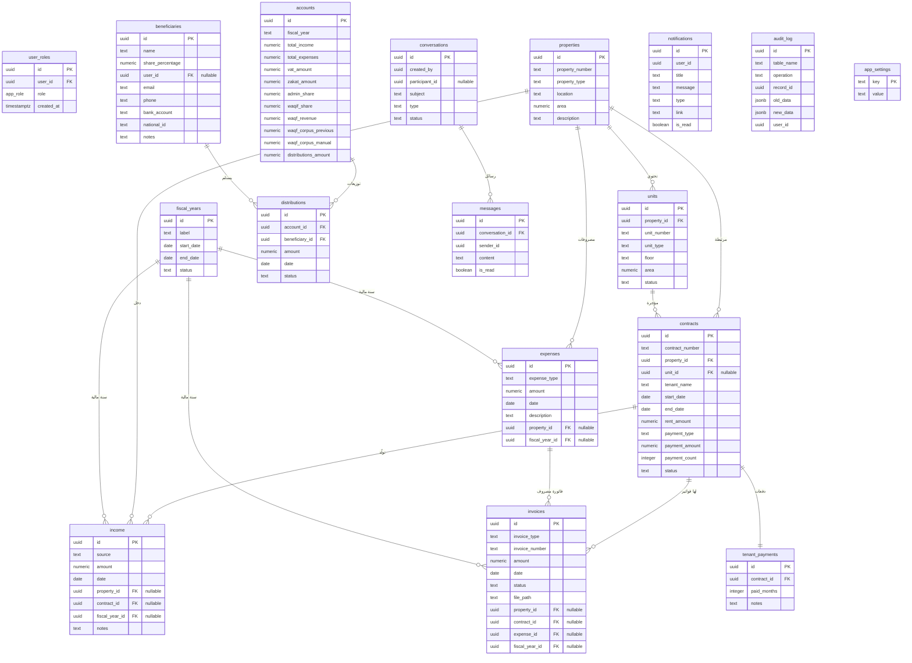

# توثيق قاعدة البيانات

## مخطط العلاقات (ERD)

---

## الجداول والأعمدة

### 1. `user_roles` — أدوار المستخدمين
| العمود | النوع | وصف |
|--------|-------|------|
| `id` | UUID | المعرف الفريد |
| `user_id` | UUID | معرف المستخدم (من نظام المصادقة) |
| `role` | app_role | الدور: `admin` / `beneficiary` / `waqif` |

### 2. `properties` — العقارات
| العمود | النوع | وصف |
|--------|-------|------|
| `property_number` | text | رقم العقار |
| `property_type` | text | نوع العقار (عمارة/أرض/...) |
| `location` | text | الموقع |
| `area` | numeric | المساحة بالمتر المربع |

### 3. `units` — الوحدات العقارية
| العمود | النوع | وصف |
|--------|-------|------|
| `property_id` | UUID | العقار التابعة له |
| `unit_number` | text | رقم الوحدة |
| `unit_type` | text | نوع الوحدة (شقة/محل/...) |
| `status` | text | الحالة: شاغرة / مؤجرة |
| `floor` | text | الطابق |

### 4. `contracts` — العقود
| العمود | النوع | وصف |
|--------|-------|------|
| `contract_number` | text | رقم العقد |
| `property_id` | UUID | العقار |
| `unit_id` | UUID | الوحدة (اختياري) |
| `tenant_name` | text | اسم المستأجر |
| `rent_amount` | numeric | مبلغ الإيجار الإجمالي |
| `payment_type` | text | نوع الدفع: سنوي/نصف سنوي/ربعي/شهري |
| `status` | text | الحالة: active / expired |

### 5. `income` — الإيرادات
| العمود | النوع | وصف |
|--------|-------|------|
| `source` | text | مصدر الدخل |
| `amount` | numeric | المبلغ |
| `date` | date | التاريخ |
| `fiscal_year_id` | UUID | السنة المالية |

### 6. `expenses` — المصروفات
| العمود | النوع | وصف |
|--------|-------|------|
| `expense_type` | text | النوع: كهرباء/مياه/صيانة/عمالة/... |
| `amount` | numeric | المبلغ |
| `date` | date | التاريخ |
| `fiscal_year_id` | UUID | السنة المالية |

### 7. `accounts` — الحسابات الختامية
| العمود | النوع | وصف |
|--------|-------|------|
| `fiscal_year` | text | تسمية السنة المالية |
| `total_income` | numeric | إجمالي الدخل |
| `total_expenses` | numeric | إجمالي المصروفات |
| `vat_amount` | numeric | ضريبة القيمة المضافة |
| `zakat_amount` | numeric | الزكاة |
| `admin_share` | numeric | حصة الناظر |
| `waqif_share` | numeric | حصة الواقف |
| `waqf_revenue` | numeric | ريع الوقف (للتوزيع) |
| `waqf_corpus_previous` | numeric | رصيد جسم الوقف السابق |
| `waqf_corpus_manual` | numeric | استقطاع جسم الوقف |
| `distributions_amount` | numeric | إجمالي التوزيعات |

### 8. `beneficiaries` — المستفيدين
| العمود | النوع | وصف |
|--------|-------|------|
| `name` | text | الاسم الكامل |
| `share_percentage` | numeric | نسبة الحصة (%) |
| `user_id` | UUID | ربط بحساب مستخدم (اختياري) |
| `national_id` | text | رقم الهوية الوطنية |
| `bank_account` | text | رقم الحساب البنكي |

---

## سياسات الأمان (RLS)

كل جدول محمي بسياسات:

| الجدول | القراءة | الكتابة |
|--------|---------|---------|
| `user_roles` | المستخدم يرى دوره فقط | الناظر فقط |
| `properties` | جميع الأدوار | الناظر فقط |
| `contracts` | جميع الأدوار | الناظر فقط |
| `income` | جميع الأدوار | الناظر فقط |
| `expenses` | جميع الأدوار | الناظر فقط |
| `accounts` | جميع الأدوار | الناظر فقط |
| `beneficiaries` | المستفيد يرى بياناته + الناظر | الناظر فقط |
| `distributions` | المستفيد يرى توزيعاته + الناظر والواقف | الناظر فقط |
| `notifications` | المستخدم يرى إشعاراته | الناظر لكل الإشعارات |
| `audit_log` | الناظر فقط | لا أحد (triggers فقط) |

---

## المشغلات (Triggers) — 22 مشغل نشط

| النوع | العدد | الوصف |
|-------|-------|-------|
| `audit_trigger` | 10 | تسجيل التغييرات في `audit_log` للجداول المالية والتعاقدية |
| `prevent_closed_fy` | 3 | منع تعديل بيانات السنوات المالية المقفلة (income, expenses, invoices) |
| `update_updated_at` | 9 | تحديث حقل `updated_at` تلقائياً عند التعديل |

---

## الدوال المخزنة (Functions)

| الدالة | الوصف |
|--------|-------|
| `has_role(user_id, role)` | التحقق من دور المستخدم (SECURITY DEFINER) |
| `notify_admins(title, message)` | إرسال إشعار لجميع المسؤولين |
| `notify_all_beneficiaries(title, message)` | إرسال إشعار لجميع المستفيدين |
| `audit_trigger_func()` | تسجيل التغييرات في سجل المراجعة |
| `prevent_closed_fiscal_year_modification()` | منع تعديل السنة المالية المقفلة |
| `update_updated_at_column()` | تحديث حقل `updated_at` تلقائياً |
| `get_public_stats()` | إحصائيات عامة للصفحة الرئيسية |

